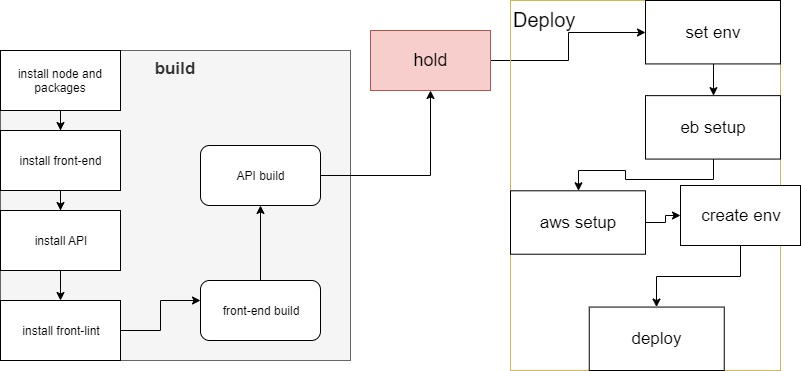

# pipline

-  wire the github account  
- on the left choose project and choose the specific project 
- will start automatic first install the PcK and front and backend depnds
- will run Lints forthe frontend.
- Builds both F/B.
- hold stage
- If is right and everythigng is file
- Installs aws, eb and setup env for deploy.
- Deploys both apps
